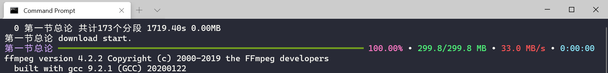
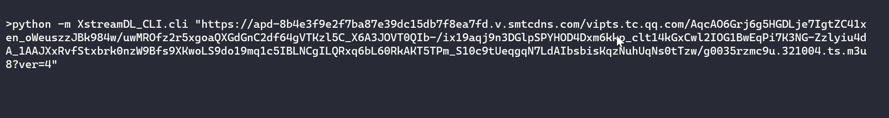
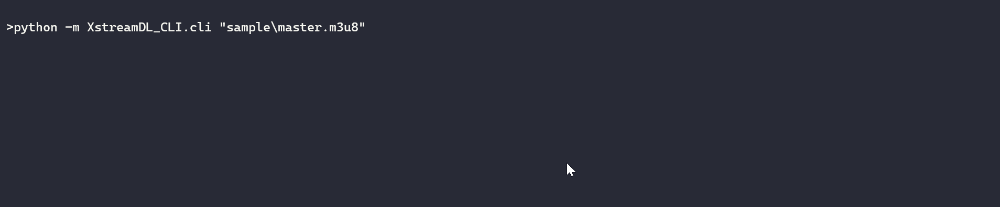
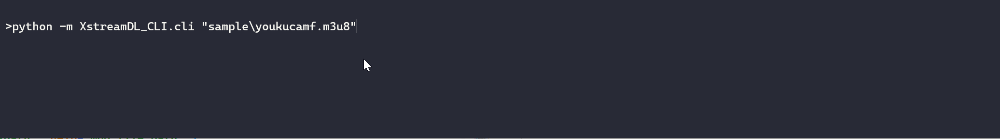

# XstreamDL-CLI
基于`python 3.7.4+`的，命令行版本的，HLS/DASH流下载器，仅支持**HLS标准AES-128-CBC**解密

## 使用

首先安装必要的库
```bash
pip install -r requirements.txt
```

```bash
python -m XstreamDL_CLI.cli [OPTION]... URL/FILE/FOLDER...
```

实例

1. 通过python执行下载模块
    ```bash
    python -m XstreamDL_CLI.cli --b64key oKi/hwKVuLveo/hISX1PQw== --hexiv b3d5ca56926d49d8e96b70aa5c7b358e --name 第一节总论 https://hls.videocc.net/d06ae002cb/2/d06ae002cb4a0bed78fb912c874fdbb2_2.m3u8
    ```
2. 通过exe直接下载
    ```bash
    XstreamDL-CLI_v1.2.0.exe --b64key oKi/hwKVuLveo/hISX1PQw== --hexiv b3d5ca56926d49d8e96b70aa5c7b358e --name 第一节总论 https://hls.videocc.net/d06ae002cb/2/d06ae002cb4a0bed78fb912c874fdbb2_2.m3u8
    ```
3. 如果使用`Windows Terminal`，可以将下面的命令保存为`bat`文件
    ```bash
    chcp 65001
    wt new-tab -p "Command Prompt" -d "%cd%" cmd /k "XstreamDL-CLI_v1.0.0.exe --b64key oKi/hwKVuLveo/hISX1PQw== --hexiv b3d5ca56926d49d8e96b70aa5c7b358e --name 第一节总论 https://hls.videocc.net/d06ae002cb/2/d06ae002cb4a0bed78fb912c874fdbb2_2.m3u8"
    ```
    
    

**合并需要先将ffmpeg置于环境变量**

**HELP INFO**

```bash
version 1.2.1, A downloader that download the HLS/DASH stream.
usage: XstreamDL-CLI [OPTION]... URL/FILE/FOLDER...

A downloader that download the HLS/DASH stream

positional arguments:
  URI                   URL/FILE/FOLDER string

optional arguments:
  -v, --version         Print version and exit
  -h, --help            Print help message and exit
  -name NAME, --name NAME
                        Specific stream base name
  -base BASE_URL, --base-url BASE_URL
                        Set base url for Stream
  -save-dir SAVE_DIR, --save-dir SAVE_DIR
                        Set save dir for Stream
  --ffmpeg FFMPEG       Set executable ffmpeg path
  --mp4decrypt MP4DECRYPT
                        Set executable mp4decrypt path
  --select              Show stream to select and download, default is to
                        download all
  --disable-force-close
                        Default make all connections closed securely, but it
                        will make DL speed slower
  --limit-per-host LIMIT_PER_HOST
                        Increase the value if your connection to the stream
                        host is poor, suggest >100 for DASH stream
  --user-agent USER_AGENT
                        set user-agent headers for request
  --referer REFERER     set custom referer for request
  --headers HEADERS     set custom headers for request, separators is |, e.g.
                        "header1:value1|header2:value2"
  --overwrite           Overwrite output files
  --raw-concat          Concat content as raw
  --disable-auto-concat
                        Disable auto-concat
  --enable-auto-delete  Enable auto-delete files after concat success
  --disable-auto-decrypt
                        Disable auto-decrypt segments before dump to disk
  --key KEY             <id>:<k>, <id> is either a track ID in decimal or a
                        128-bit KID in hex, <k> is a 128-bit key in hex
  --b64key B64KEY       base64 format aes key, only for HLS standard
                        AES-128-CBC encryption
  --hexiv HEXIV         hex format aes iv
  --proxy PROXY         use http proxy, e.g. http://127.0.0.1:1080
  --split               Dash option, split one stream to multi sections
  --repl                REPL mode
```

部分参数说明

- `--select`
    选择要下载的流，如遇到master类型m3u8且不止一条流时
- `--disable-force-close`
    使用此选项可提升下载速度，但可能会造成部分连接在下载完成后无法关闭，影响网络连接性
- `--limit-per-host`
    设定单个域名的连接数，网络较差，使用代理等情况下适当增加可以提升下载速度
- `--proxy`
    暂时只支持HTTP代理

## pyinstaller打包

```bash
pyinstaller -i logo.ico -n XstreamDL-CLI_v1.2.1 -F XstreamDL_CLI\__main__.py
```

## 示意

- 普通m3u8下载



- master m3u8下载



- 特殊master m3u8下载



## 特性

- 基于aiohttp

## 其他

- 逐步完善中

# 参考

- https://tools.ietf.org/html/rfc8216